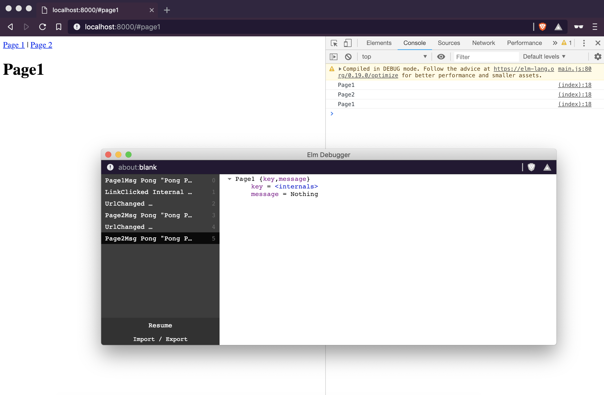

# Source to investigate problem of subscriptions and ports

## Problem

In Page1 and Page2 init, they have sent a Port command to send ping text. The JavaScript received the text and print in the console. The JavaScript also immediately pong back the elm.

When page navigating with link clicking, the pongs work well.

However, when changing the URL in the Location Bar in browser,
for example, current URL is `/#page2`, edit the URL in browser location bar to `/#page1`

- The `Main.subscriptions` received a model of Page1
- The Pong port was sent to `Page2.subscription` (by checking debug history)

